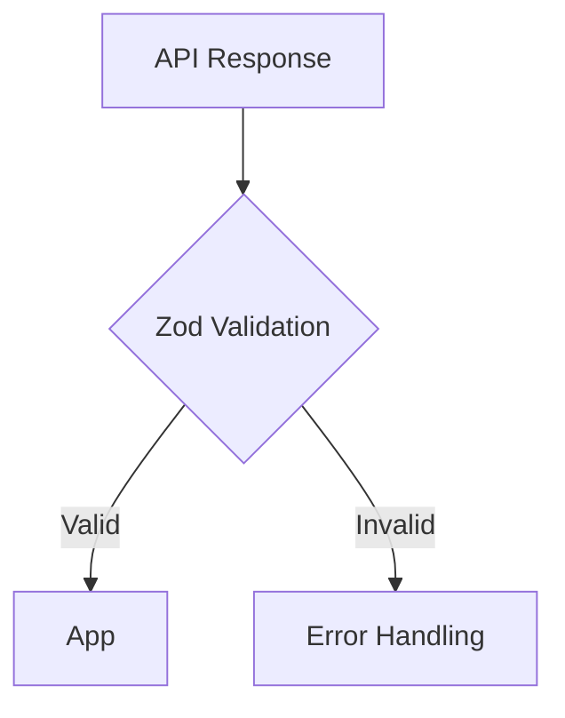
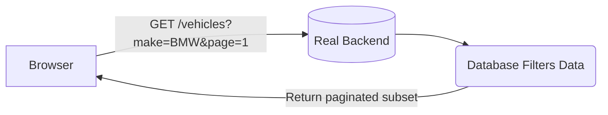
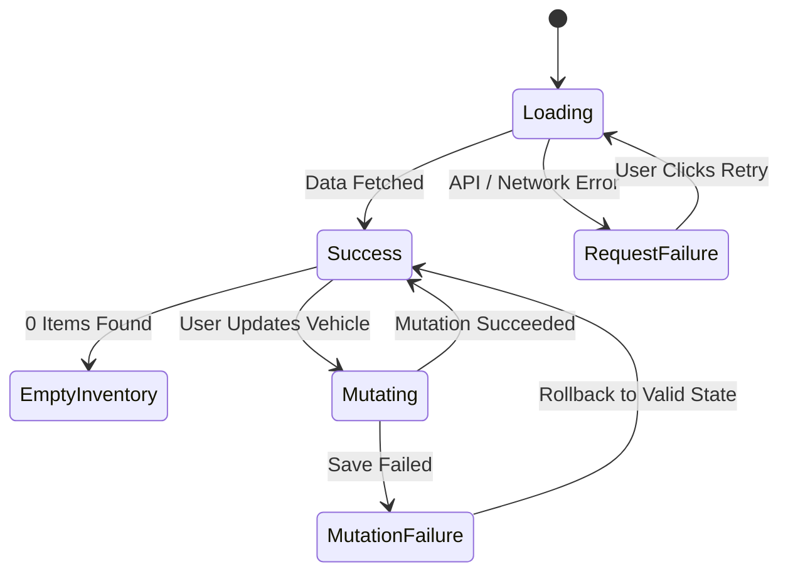
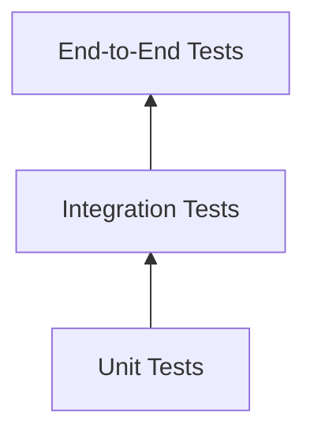
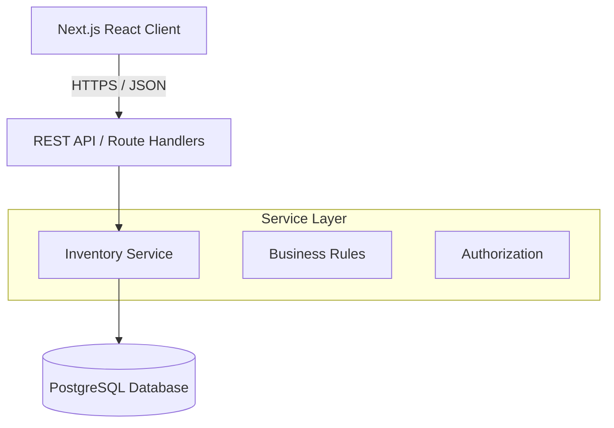
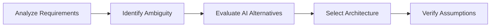
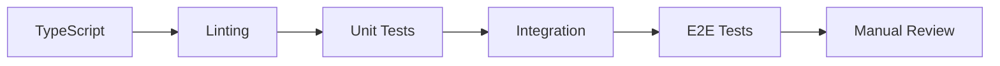

# System Design Document — Intelligent Inventory Dashboard

## 1. Overview 
This document describes the proposed architecture for the Intelligent Inventory Dashboard, a web application designed to help dealership managers understand and manage their current vehicle inventory. 

The application focuses on three core capabilities: 
* Displaying and filtering dealership vehicle inventory. 
* Automatically identifying vehicles that have remained in inventory for more than 90 days. 
* Allowing managers to record and persist a proposed action for aging vehicles. 

For this technical assessment, the frontend application will be fully implemented, while the backend will be represented by a mocked REST API. The architecture is designed so that the mocked service can later be replaced by a production backend without significant changes to the frontend. 

## 2. Requirements 

### Functional Requirements 

#### Inventory Visualization 
The system must display vehicles currently available in a dealership's inventory. Managers should be able to filter vehicles instantly using a unified search interface by attributes such as: Make, Model, VIN, Status, and Age.

Each vehicle row must display useful information including: 
* VIN 
* Make & Model 
* Model year 
* Vehicle Status 
* Number of days in inventory 
* Current proposed action 

#### Aging Stock Identification 
Vehicles that have remained in inventory for more than 90 days must automatically be classified as aging stock. The UI should make these vehicles visually distinguishable so dealership managers can quickly identify inventory that may require attention.  

The aging status is derived dynamically in the presentation layer using:  
`agingStock = daysInInventory > 90` 

The `agingStock` boolean status is calculated on the fly by the client rather than stored independently in the database. This prevents state inconsistencies and ensures the UI always accurately reflects the raw `daysInInventory` integer provided by the backend API. 

#### Actionable Insights 
For vehicles identified as aging stock, managers can assign a proposed action. Examples include: 
* Price Reduction Planned 
* Marketing Campaign 
* Transfer to Another Dealership 
* Review Required 
* No Action 

The selected action is sent to the API and persisted by the backend. For the technical assessment, the persistence behaviour will be simulated by the mocked API. 

## 3. Assumptions 
The original requirements intentionally contain some ambiguity. The following assumptions are made for this implementation:

**Aging Stock** 
A vehicle is considered aging stock when `daysInInventory > 90`. Therefore, a vehicle that has been in inventory for exactly 90 days is not considered aging stock. 

**Authentication** 
Authentication and authorization are outside the scope of the implementation. The system assumes the current user is an authenticated dealership manager with permission to view and update inventory for their dealership. In a production system, authentication could be handled using an identity provider and role-based access control. 

**Dealership Context** 
The current dealership is assumed to already be known from the authenticated user's session. The frontend therefore requests inventory for a single dealership rather than requiring dealership selection. 

**Backend** 
The technical assessment requires the frontend service layer to be implemented fully. The backend will therefore be mocked using HTTP request interception while maintaining a realistic REST API contract. This allows the UI to behave as though it were communicating with a real backend. 

## 4. High-Level Architecture 
The frontend communicates exclusively through an API abstraction rather than importing mock data directly. This separation means the mocked API can later be replaced with a real backend while keeping the majority of the frontend unchanged. 

```mermaid
graph TD
    Client[Browser / Client]
    
    subgraph Next.js Frontend
        UI[Dashboard UI Components]
        State[InventoryDashboard Client State]
    end
    
    subgraph Mocked Backend API (MSW)
        Route1[GET /api/inventory]
        Route2[PATCH /api/inventory/:id/action]
        MockDB[(In-Memory Mock Database)]
    end

    Client -->|HTTP GET / HTTP PATCH| UI
    UI <--> State
    State -->|Fetch API| Route1
    State -->|Fetch API| Route2
    Route1 --> MockDB
    Route2 --> MockDB
```

## 5. Component Responsibilities 

**Inventory Dashboard (`InventoryDashboard.tsx`)** 
The main page of the application. Its responsibilities include: 
* Displaying high-level inventory information (e.g., Total Vehicles and Aging Stock summaries). 
* Delegating data fetching and mutations to TanStack Query. 
* Displaying loading, empty, and error states. 
* Composing and rendering the child `InventoryTable` component. The page itself remains primarily responsible for data fetching and layout composition rather than low-level business logic. 

**Inventory Table (`InventoryTable.tsx`)** 
This component handles the complex presentation and interaction logic of the dataset. Its responsibilities include: 
* Displaying the vehicle inventory data in a sortable table structure. 
* Managing global search and filter state. 
* Highlighting aging vehicles via cell formatting. 
* Providing access to proposed-action controls for qualifying aging vehicles. 

**Aging Stock Badge (`AgingStockBadge.tsx`)** 
A micro-component responsible purely for visual distinction. 
* Styling Logic: Takes a days prop and dynamically applies warning colors (Red) if the vehicle is aging stock (> 90), or standard muted colors otherwise. 

**Infrastructure Providers (`ReactQueryProvider.tsx` & `MSWProvider.tsx`)** 
Context Wrappers: Sit at the root of the application to provide global context (React Query Client) and conditionally initialize the Mock Service Worker before the React tree mounts. 

**Proposed Action Control & Optimistic UI** 
The Proposed Action component allows a manager to assign an action to an aging vehicle. To ensure a lightning-fast user experience, the system utilizes an Optimistic Update pattern via TanStack Query. 
* Error Handling & Feedback: The control provides visual feedback (disabling the save button and showing a "Saving..." state) while the network request is in flight. If the mutation fails, TanStack Query automatically rolls back the optimistic cache update to its previous state, and the UI clearly communicates the failure to the user via an alert dialog. 

**API Client** 
The API client isolates HTTP communication from presentation components. 
* Example methods: `getVehicles()`, `updateVehicleAction(vehicleId, action)` 
Components should not directly call `fetch()`. This keeps transport-specific behaviour in one location and makes migration from mocked APIs to a production backend straightforward. 

**TanStack Query** 
TanStack Query manages server-state behaviour. Responsibilities include: Fetching inventory, Request caching, Loading states, Error states, Mutation handling, Cache invalidation, and Retry behaviour. Server data is intentionally kept separate from local UI state such as selected filters. 

**Mock Service Worker (MSW)** 
Mock Service Worker intercepts network requests during local development and testing.  
* Example mocked endpoints: `GET /api/inventory`, `PATCH /api/inventory/:id/action` 
The frontend therefore communicates with the mock using the same HTTP interface it would use with a real backend. This provides a more realistic architecture than directly importing JSON files into React components. 

## 6. Proposed Data Model 
A simplified vehicle model is represented as:  
```typescript
type Vehicle = {  
  id: string  
  vin: string  
  make: string  
  model: string  
  year: number  
  status: string 
  daysInInventory: number  
  proposedAction: string | null  
}  
```
Aging status is intentionally derived rather than persisted on the backend:  
```typescript
type VehicleViewModel = Vehicle & {  
  isAgingStock: boolean  
}  
```
This prevents redundant data from becoming inconsistent. 

## 7. API Design 
Although the backend is mocked, the application uses a realistic REST API contract. 

**Retrieve Inventory** 
`GET /api/inventory` 
Example response:  
```json
{ 
  "data": [  
    {  
      "id": "v1",  
      "vin": "1T1B11BK111111111",  
      "make": "Toyota",  
      "model": "Camry",  
      "year": 2022,  
      "daysInInventory": 15, 
      "status": "Available", 
      "proposedAction": null  
    }  
  ] 
} 
```

**Update Proposed Action** 
`PATCH /api/inventory/:id/action`  
Request:  
```json
{  
  "proposedAction": "Price Reduction Planned"  
}  
```
Response:  
```json
{  
  "data": {  
     "id": "v3",  
     "vin": "1FTFW1ED1PFA11111",  
     "make": "Ford",  
     "model": "F-150",  
     "year": 2023,  
     "daysInInventory": 95,  
     "status": "Available",  
     "proposedAction": "Price Reduction Planned"  
  } 
}  
```
A PATCH request is appropriate because only one field of the vehicle resource is being updated. 

**Error Handling** 
If a PATCH request is made for an invalid or non-existent vehicle ID, the API correctly responds with standard HTTP error codes: 
Response (404 Not Found): 
```json
{ 
  "error": "Vehicle not found" 
} 
```

## 8. Data Flow 

**Initial Inventory Loading** 
While the request is in progress, the UI displays a skeleton loading state. If the request fails, the UI renders an error state displaying the failure message. 

**Filtering Flow** 
For the scope of this assessment, filtering occurs client-side because the dataset is small. For a production environment with significantly larger datasets, filtering and pagination would move to the backend. 

**Updating Aging Vehicle Action** 
If the mutation fails, the user receives an error message and TanStack Query automatically rolls the UI back so it remains consistent with the last successfully persisted state. 

**Sorting Flow** 
Similar to filtering, sorting occurs client-side because the dataset is small enough to be held entirely in memory. For a production environment with significantly larger datasets, sorting operations would be deferred to the backend API via query parameters (e.g., `?sortBy=daysInInventory&order=desc`). 

## 9. Technology Choices 

**React** 
React is used to build the component-based user interface. 
*Reasons:* Strong ecosystem, well suited for interactive dashboards, encourages reusable UI components, mature testing ecosystem, widely used in production frontend applications. 

**TypeScript** 
TypeScript provides static typing throughout the application. 
*It improves:* API contract correctness, refactoring safety, developer experience, domain model clarity, and maintainability. For example, vehicle actions can be restricted to known values rather than arbitrary strings. 

**Next.js**  
Next.js is used as the foundational React framework and build tool. 
*Reasons:* 
* Provides a robust, production-ready architecture out-of-the-box. 
* Built-in file-based routing (App Router) simplifies navigation. 
* Fast development environment with Turbopack. 
* Sets a solid, enterprise-grade foundation while allowing the implementation to remain focused on client-side functionality.

**TanStack Query** 
TanStack Query manages API/server state. 
*Reasons:* Request caching, automatic request lifecycle handling, mutation support, error handling, and retry capabilities. Removes unnecessary custom data-fetching code and makes future integration with a real backend straightforward. 

**Mock Service Worker (MSW)** 
MSW is used to simulate the backend. 
*Reasons:* Intercepts actual HTTP requests, keeps the application's API layer realistic, can be reused in automated tests, allows simulation of latency and API failures. 

**Zod** 
Zod is used at API boundaries to validate external data. Although TypeScript provides compile-time safety, it cannot guarantee that runtime API responses follow the expected contract. This provides additional protection against malformed backend responses. 


**Vitest & React Testing Library** 
Vitest provides fast test execution for core business logic. React Testing Library handles component/integration testing focused on user-visible behavior rather than implementation details. 

## 10. Scalability and Performance 
Although the assessment uses a mocked dataset, the design considers future production requirements. 

**Server-Side Filtering & Pagination** 
For a large dealership network, filtering, sorting, and pagination could move to the backend to prevent unnecessarily large payloads. Because this project is built on Next.js, transitioning to a real backend could be seamlessly done using Next.js Route Handlers.


**Caching & Rendering Performance** 
* **TanStack Query** provides powerful in-memory caching. Updates to vehicle actions seamlessly invalidate or optimistically update the relevant cached vehicle, keeping the UI snappy. 
* **React Keys:** Vehicle rows use stable identifiers (React keys) to ensure efficient DOM updates. If the inventory becomes excessively large in a single view, techniques such as Pagination, Memoization, and Virtualized lists could be introduced. 

## 11. Reliability and Error Handling 
The application is designed to be resilient, explicitly handling the complete lifecycle of API states: 
* **Loading:** Displaying skeletons or spinners during network requests. 
* **Success:** Rendering the data seamlessly. 
* **Empty Inventory:** Showing a friendly "no results" state when appropriate. 
* **Request Failure:** Catching network or server errors gracefully. 
* **Mutation Failure:** Handling errors when updating data (e.g., updating a vehicle's status). 
* **Malformed Response:** Catching unexpected API payloads (validated via Zod). 

**Error UX Strategy** 
API errors must never result in a blank page or a broken UI. Instead, the user is presented with a meaningful error message and, where appropriate, the ability to recover from the error. 


## 12. Testing Strategy 
Testing is divided into three levels following the standard testing pyramid principle. 


**Unit Tests** 
Pure domain logic receives focused unit tests to ensure business rules are strictly adhered to. 
Example: Aging stock boundary calculations 
* 89 days → Not aging  
* 90 days → Not aging  
* 91 days → Aging  
* 120 days → Aging  

**Integration Tests** 
React Testing Library and MSW are used to validate the interactions between the UI components, TanStack Query, the API client, and the Mock API. Examples of validated behaviors: 
* Inventory loads successfully. 
* API failures display an appropriate error state. 
* Filtering, sorting, and highlighting work as expected. 
* A mutation failure displays appropriate user feedback (and preserves the previous state).

## 13. Accessibility 
Accessibility is treated as a core component of application quality rather than an optional enhancement. 
* **Semantic HTML:** Using native elements (like `<button>`, `<nav>`) to ensure compatibility with screen readers. 
* **Proper Table Headers:** Ensuring data tables (`<th>`) are correctly associated with their rows and columns. 
* **Associated Labels:** Explicit `<label>` tags for all filter inputs and interactive controls. 
* **Keyboard Accessibility:** Ensuring all controls can be reached and activated using only a keyboard. 
* **Visible Focus States:** Clear outlines for focused elements. 
* **Accessible Loading & Error States:** Using ARIA live regions to announce loading states. 
* **Multi-Sensory Indicators:** Never relying exclusively on color to convey meaning (e.g., Aging vehicles include explicit text badges, not just a red background). 

## 14. Security Considerations 
Although authentication is outside the assessment scope, the production architecture should consider: Authentication, Authorization, Role-based access, Input validation, Transport security, Secure session management, and Avoiding sensitive data in frontend logs. 

> [!IMPORTANT]
> **Frontend validation cannot replace server-side validation.** For example, the backend must independently verify that the proposed action is one of the supported values before saving.

## 15. Future Backend Architecture 
While the current assessment leverages a mocked API using MSW, the frontend architecture is designed so that the mock can be seamlessly swapped out for a real backend without rewriting the client-side data fetching layer. 

Aging calculations can remain in the frontend for immediate presentation purposes, but the backend must also independently enforce these business definitions when the aging status becomes important for downstream business processes. 

## 16. GenAI Collaboration During the Design Phase 
Generative AI was utilized strictly as an engineering collaborator, not as an automated decision-maker. 

**Design Process Workflow:** 

* **Requirement Analysis:** AI helped extract hidden business rules from ambiguous requirements (e.g., clarifying that "aging stock" strictly means >90 days). 
* **Architecture Evaluation:** AI was used to weigh technical trade-offs. For instance, Next.js was selected over Vite for a more robust foundation, and MSW was chosen over static JSON to simulate genuine network request lifecycles. 
* **Edge-Case Identification:** AI proactively generated potential failure states which directly informed the testing strategy. 
* **Verification:** AI outputs were rigorously validated against system behavior and actual business needs. 

**Code Verification Pipeline:** 
All AI-assisted code passes through a strict quality pipeline to ensure the engineer retains absolute ownership of correctness: 


## 17. Summary 
The proposed solution leverages a modular Next.js React architecture with a strict separation of concerns between presentation, domain logic, server-state management, and API communication. 

Although the backend infrastructure is currently mocked for the scope of the assessment, the frontend interacts via a realistic REST API contract (intercepted by MSW). This ensures that the mock service can be effortlessly swapped for a production backend without requiring significant client-side architectural rewrites. 

Throughout the design and implementation, this solution prioritizes: 
* Maintainability (Modular architecture, TypeScript strictness) 
* Testability (Independent domain logic, Testing Pyramid principles) 
* Reliability (Graceful error boundaries, explicit API state handling) 
* Scalability (Extensible Next.js foundation, prepared for backend pagination) 
* Observability (Structured logging, strict separation of metrics) 
* Accessibility (Semantic HTML, multi-sensory indicators) 
* AI Ownership (Clear engineering accountability for all AI-assisted decisions) 

Ultimately, the resulting implementation remains intentionally focused and simple for the current requirements, while providing robust, well-documented extension points for a large-scale production inventory platform. 
